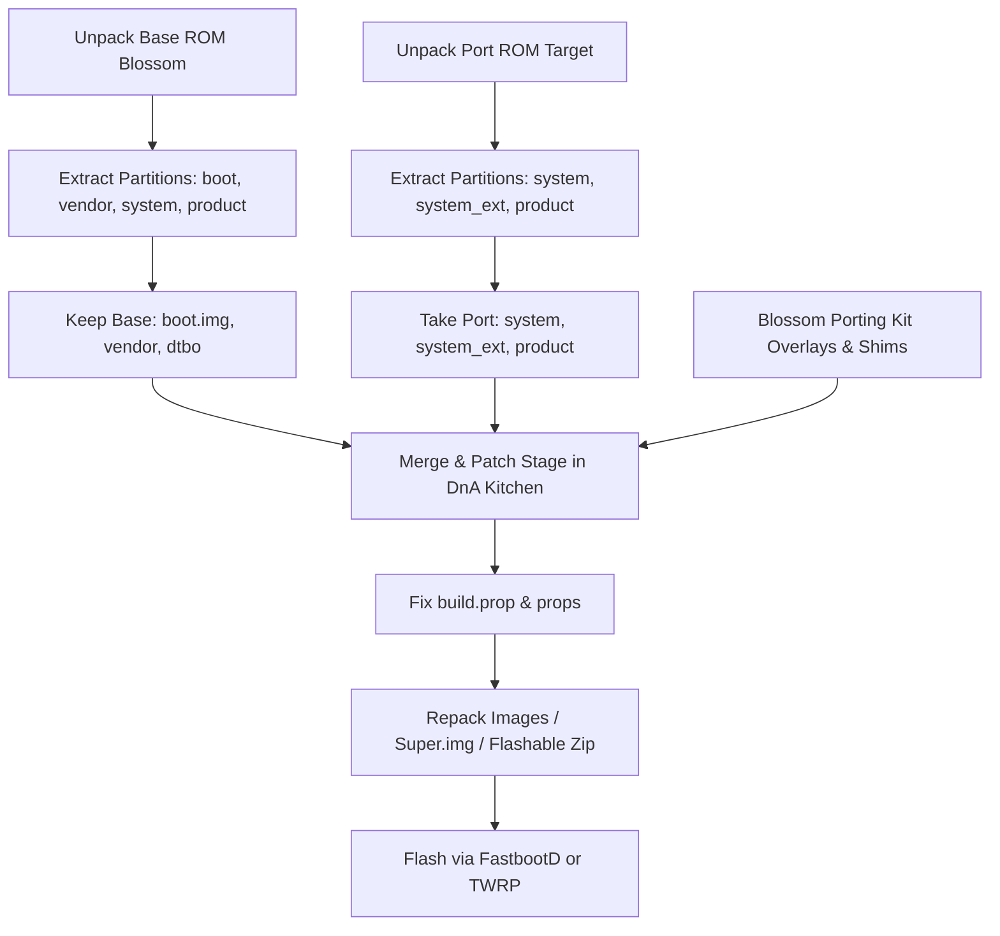

# Complete Guide: Porting ROMs with DnA Android Kitchen for Xiaomi Blossom

This comprehensive guide teaches you step-by-step how to use **DnA Android Kitchen** (and similar ROM porting kitchens like CRB, SuperR's Kitchen, or Android Kitchen) to port any ROM (**MIUI, HyperOS, AOSP, PixelOS, OneUI, OxygenOS**) to **Xiaomi Blossom** (Redmi 9A, 9C, 9 Activ, Poco C3).

---

## Core Porting Concepts: Base vs. Port ROM

| Term | Description | For Xiaomi Blossom |
|---|---|---|
| **Base ROM (Donor / Target Device)** | The working stock ROM specifically created for Xiaomi Blossom. Provides the **kernel (`boot.img`)**, **vendor hardware drivers (`vendor/`)**, audio/camera/sensor HALs, and partition table. | Stock Blossom MIUI Fastboot ROM or a working Custom ROM for Blossom. |
| **Port ROM (Source ROM / UI Base)** | The ROM you want to port onto Blossom (e.g. HyperOS from Redmi Note 11, MIUI from Redmi 10X, PixelOS from an MTK device). | The target firmware containing the UI, frameworks, and system apps. |

---

##  Prerequisites & Tools Needed

1. **DnA Android Kitchen** (or CRB / SuperR Kitchen / Carliv Image Kitchen).
2. **Base ROM**: Stock Fastboot ROM for Xiaomi Blossom (`dandelion` or `angelica` or `cattail` - MIUI 12.5 Fastboot `.tgz`).
3. **Port ROM**: The target ROM you want to port (Fastboot ROM or Flashable zip for a MediaTek device with same SoC family or architecture).
4. **Xiaomi Blossom Porting Kit** (this repository with overlays, shims, XMLs, and props).
5. **7-Zip / WinRAR / zstd** for archive extraction.
6. **Notepad++ / VS Code** for editing `.prop` and XML files.

---

## Step-by-Step Porting Workflow in DnA Kitchen



---

## Step 1: Unpack Base and Port ROMs

1. Open **DnA Android Kitchen**.
2. **Set Base ROM**:
 - Extract `super.img` or the raw partition images (`system.img`, `vendor.img`, `product.img`, `boot.img`) of the **Blossom Base ROM**.
 - Load it into DnA Kitchen as the **Base / Working Project**.
3. **Set Port ROM**:
 - Extract `super.img` or partition images of your **Port ROM** in DnA Kitchen under the **Port Project**.

---

## Step 2: Structure Partition Replacement

When merging the ROMs in DnA Kitchen:

| Partition | Action in DnA Kitchen | Why? |
|---|---|---|
| **`boot.img`** | **Keep 100% BASE (Blossom)** | Contains Blossom's MediaTek MT6762/MT6765 kernel and ramdisk. |
| **`dtbo.img`** | **Keep 100% BASE (Blossom)** | Device Tree Blob for Blossom hardware. |
| **`vendor/`** | **Keep 100% BASE (Blossom)** | Contains Blossom camera, audio, sensor, and display HAL drivers. |
| **`system/`** | **Use PORT ROM** (with Blossom patches applied) | The core OS, frameworks, and features of the target ROM. |
| **`product/`** | **Use PORT ROM** (with Blossom overlays added) | System apps, themes, and product configurations. |
| **`system_ext/`**| **Use PORT ROM** | Extension frameworks and services. |

---

## Step 3: Inject Blossom Overlays, Libs & Shims (Crucial Step)

From this repository, copy the necessary files into the **Port ROM** project inside DnA Kitchen:

### 1. Waterdrop Notch & Display Overlay Fix
Copy the following overlay APKs into the Port ROM:
- Copy `apks/DisplayOverlayBlossom.apk` to `system/product/overlay/DisplayOverlayBlossom.apk`.
- Copy `apks/FrameworksResOverlayBlossom.apk` to `vendor/overlay/FrameworksResOverlayBlossom.apk`.
- Copy `apks/SystemUIOverlayBlossom.apk` to `vendor/overlay/SystemUIOverlayBlossom.apk`.
- Ensure permissions are set to `0644` (`rw-r--r--`).

### 2. MediaTek GraphicBufferMapper & VNDK Shim Fixes
If porting Android 12, 13, 14, or HyperOS, MTK camera and graphics will crash without shims:
- Copy `port_libs_and_shims/vndk/libui-v32.so` to `system/lib64/vndk-v32/libui.so` (or `system/system/lib64/`).
- Copy `port_libs_and_shims/libshims/libshim_ui/GraphicBufferMapper.cpp` compiled binary (`libshim_ui.so`) into `system/lib64/` or `vendor/lib64/`.
- Append `libshim_ui.so` into `/vendor/etc/public.libraries.vendor.txt`.

### 3. VoLTE & Dual 4G Carrier Configurations
- Copy `xmls/carrier/vendor_miui.xml` and `xmls/carrier/vendor_device.xml` to `vendor/etc/carrier/`.
- Copy `apks/CarrierConfigOverlayBlossom.apk` to `vendor/overlay/CarrierConfigOverlayBlossom.apk`.

### 4. Audio & Thermal Parameter Sync
Ensure the Port ROM has Blossom's audio routing:
- Verify `vendor/etc/audio_policy_configuration.xml` and `vendor/etc/aurisys_config.xml` match the files from `xmls/audio/`.
- Copy `xmls/thermal/thermal_info_config.json` to `vendor/etc/thermal_info_config.json`.

---

##  Step 4: Fix `build.prop` and Properties

Open `system/build.prop`, `vendor/build.prop`, and `product/build.prop` in the Port Project and configure:

### 1. Device Identity Props (Required for proper detection & SafetyNet)
```properties
ro.product.model=Redmi 9A
ro.product.brand=Xiaomi
ro.product.name=blossom
ro.product.device=blossom
ro.build.product=blossom
ro.product.manufacturer=Xiaomi
```

### 2. MIUI / HyperOS Notch & Display Props
```properties
ro.miui.notch=1
ro.miui.has_real_notch=1
ro.vendor.display.type=1
```

### 3. MediaTek Telephony & Performance Props
```properties
persist.vendor.radio.mtk_ps4_support=1
ro.vendor.mtk_telephony_add_on_policy=0
ro.vendor.pref_scale_enable=1
ro.vendor.perf_touch_boost=1
```

---

## Step 5: Repack in DnA Kitchen

1. In **DnA Kitchen**, run **Build / Repack Partitions**:
 - Select filesystem: `ext4` or `erofs` (match Base ROM format).
 - Set partition size: Dynamic / Auto-calculate.
2. Build `super.img` or create a **Flashable Recovery ZIP**:
 - DnA Kitchen will generate `super.img` containing `system`, `vendor`, `product`, `system_ext`.
 - Or generate a TWRP/OrangeFox flashable ZIP with dynamic partition metadata.

---

## Step 6: Flashing Your Ported ROM

### Method 1: Flashing via FastbootD
```bash
# Reboot into FastbootD mode
adb reboot fastboot

# Flash partitions
fastboot flash boot boot.img
fastboot flash dtbo dtbo.img
fastboot flash super super.img
fastboot -w
fastboot reboot
```

### Method 2: Flashing via TWRP / OrangeFox Recovery
1. Boot into OrangeFox / TWRP recovery.
2. Wipe: **Dalvik / ART Cache, Cache, System, Vendor, Data**.
3. Flash your ported ROM ZIP.
4. (Optional) Flash Magisk or KernelSU for root.
5. Format Data (type `yes`) and Reboot System.

---

## Step 7: Debugging Bootloops (ADB Logcat)

If your port gets stuck on the boot animation (bootloop):

1. Connect phone to PC with USB cable.
2. Run adb logcat to see why it is crashing:
 ```bash
 adb wait-for-device && adb logcat -b all -v time > port_bootlog.txt
 ```
3. Search `port_bootlog.txt` for `AndroidRuntime` fatal exceptions:
 - **`Fatal signal 11 (SIGSEGV)` in SurfaceFlinger**: Missing `GraphicBufferMapper` shim or display cutout error -> Check `DisplayOverlayBlossom.apk` and `libshim_ui.so`.
 - **`SELinux: Denied`**: SELinux blocking HAL -> Set SELinux to permissive in `boot.img` cmdline (`androidboot.selinux=permissive`) during port testing.
 - **`ServiceManager: Cannot find android.hardware.audio`**: Mismatched audio service in `vendor/etc/init/` -> Restore Base `audio.rc` and HAL files.

---

## License & Credits
- Xiaomi Blossom Device Tree maintained by [crDroid Android](https://github.com/crdroidandroid) & [LineageOS](https://github.com/LineageOS).
- DnA Android Kitchen by the DnA Developer Team.
- Apache 2.0 License.
