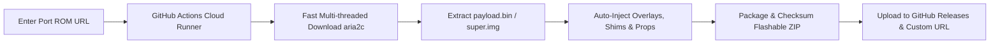

# Xiaomi Blossom (Redmi 9A / 9C / 9 Activ) Overlays, Configs & Complete Porting Kit

A complete, production-ready repository containing extracted & compiled display overlays, decompiled XML trees, vendor libraries, MediaTek shims, SELinux policies, init/fstab scripts, backend automation tools, **GitHub Actions Cloud Auto-Porter Workflow**, and comprehensive guides for **Xiaomi Blossom** (`dandelion`, `angelica`, `angelican`, `cattail` — MediaTek MT6762G, MT6765, MT6765G).

Designed for **GSI (Generic System Image) Porters**, **MIUI / HyperOS Porters**, **DnA Android Kitchen Porters**, **AOSP / Custom ROM Developers**, and **Treble Maintainers**.

> 🚀 **Automate Everything on GitHub Actions:**  
> Want to port any ROM in the cloud without downloading gigabytes of files locally?  
> Use our **[GitHub Actions Auto-Port Workflow](#-cloud-auto-port-github-actions-workflow)**! Paste any Port ROM URL -> Click Run -> Download your ready-to-flash Blossom ROM from GitHub Releases!

---

## 📱 Device Specifications & Target Models

| Parameter | Specification |
|---|---|
| **Codename** | `blossom` (`dandelion`, `angelica`, `angelican`, `cattail`) |
| **Target Devices** | Xiaomi Redmi 9A, Redmi 9C, Redmi 9 Activ, Redmi 9 India, Poco C3 |
| **Platform / SoC** | MediaTek Helio G25 / G35 (MT6762G / MT6765 / MT6765G) |
| **Architecture** | ARM64 (`arm64-v8a`) |
| **Display Resolution** | 720 x 1600 (HD+ 20:9 Aspect Ratio) |
| **Display Cutout Notch** | Waterdrop Notch (`M 0,0 H -64 V 60 H 64 V 0 H 0 Z`) |
| **Status Bar Height** | `56.0px` (Portrait), `24.0dp` (Landscape) |
| **Rounded Corners Radius** | `33dp` |
| **Treble Architecture** | System-as-Root (SAR), VNDK 30/31/32, Dynamic Partitions (VAB/Retrofit) |

---

## 🚀 Cloud Auto-Port (GitHub Actions Workflow)

You can automatically port any ROM directly in GitHub Cloud using our automated workflow ([`.github/workflows/auto_port.yml`](.github/workflows/auto_port.yml)):



### How to Run the Cloud Auto-Porter:
1. Go to your GitHub Repository: **`https://github.com/frnAlt/Xiaomi_blossom_stuff`**
2. Click on the **Actions** tab at the top.
3. In the left sidebar, click **"🚀 Automatic ROM Porter for Xiaomi Blossom"**.
4. Click the **"Run workflow"** button on the right.
5. Fill in the input fields:
   - **Port ROM URL**: Direct download link of the target ROM (e.g. HyperOS from Redmi Note 11, PixelOS, OneUI, etc.).
   - **Base ROM URL** *(Optional)*: Direct link to stock Blossom Fastboot ROM (leave empty to use repository stock templates).
   - **Target Variant**: Select `blossom` (All models), `dandelion` (9A), `angelica` (9C), or `cattail` (9 Activ).
   - **ROM Name / Type**: Enter name (e.g. `HyperOS`, `MIUI14`, `PixelOS`).
   - **Custom Upload URL** *(Optional)*: Enter a custom server URL or `https://transfer.sh/` to upload the finished build.
6. Click **"Run workflow"**. Once the workflow finishes (approx. 5–10 mins), your ported ROM will be attached directly under **GitHub Releases** and **Actions Artifacts** ready to download and flash!

---

## 📁 Repository Structure

```text
├── .github/workflows/
│   └── auto_port.yml                     # 🚀 GitHub Actions End-to-End Cloud ROM Porter
│
├── tools/                                # ⚙️ Backend Automation & CLI Porting Suite
│   ├── auto_porter.py                    # Complete End-to-End CLI Porter (Download -> Extract -> Merge -> Package)
│   ├── port_helper.py                    # Automated ROM Port Engine (Overlays, Shims, Props injection)
│   ├── build_overlays.py                 # Automated RRO Overlay Compiler & Signer (aapt + apksigner)
│   ├── create_magisk_module.py           # Flashable Magisk/KernelSU ZIP Packager
│   └── verify_tree.py                    # Tree Integrity & Port Diagnostic Validator
│
├── DNA_KITCHEN_PORTING_GUIDE.md          # 🍳 Complete Guide for Porting with DnA Kitchen (Base -> Port)
├── PORTING_GUIDE.md                      # 📖 Standalone Comprehensive Porting Manual
├── Blossom_Notch_Fix_Magisk.zip          # ⚡ Ready-to-flash Magisk / KernelSU Notch Fix Module
│
├── apks/                                 # 📦 Compiled, Zipaligned, and Signed Overlay APKs
│   ├── FrameworksResOverlayBlossom.apk   # Full framework overlay (Notch, Brightness, Doze, Power)
│   ├── DisplayOverlayBlossom.apk         # Dedicated Display Cutout & Statusbar overlay
│   ├── display_overlay.apk               # Drop-in display overlay binary for ROMs/GSIs
│   ├── SystemUIOverlayBlossom.apk        # SystemUI statusbar paddings, headers & system icons
│   ├── SettingsOverlayBlossom.apk        # Settings UI customizations
│   ├── CarrierConfigOverlayBlossom.apk   # VoLTE / IMS / Carrier provisioning
│   ├── WifiResOverlayBlossom.apk         # Wi-Fi 2.4/5GHz resources and channels
│   ├── DialerOverlayBlossom.apk          # Dialer & in-call UI overlays
│   ├── TelephonyOverlayBlossom.apk       # Telephony stack overlays
│   ├── LauncherOverlayBlossom.apk        # Launcher3 grid & icon configs
│   ├── treble_gsi/                       # ⚡ Treble GSI Specific Overlays
│   │   └── treble-overlay-xiaomi-blossom.apk
│   └── vendor_overlay_prebuilts/         # 📁 Standard /vendor/overlay/ prebuilts
│       ├── framework-res__auto_generated_rro_vendor.apk
│       ├── SystemUI__auto_generated_rro_vendor.apk
│       ├── Settings__auto_generated_rro_vendor.apk
│       ├── CarrierConfig__auto_generated_rro_vendor.apk
│       ├── WifiRes__auto_generated_rro_vendor.apk
│       └── Telephony__auto_generated_rro_vendor.apk
│
├── extracted_display_overlay_xml/        # 🎯 Decompiled & Extracted XMLs from display_overlay.apk
│   ├── AndroidManifest.xml               # Target package ("android") & overlay priority
│   ├── display_cutout_notch.xml          # Clean standalone Notch Path + Statusbar + Corners
│   ├── display_dimens.xml                # Extracted dimension resources (status_bar_height, corners)
│   ├── display_strings.xml               # Extracted string resources (config_mainBuiltInDisplayCutout)
│   ├── display_bools.xml                 # Extracted boolean flags (config_fillMainBuiltInDisplayCutout)
│   ├── brightness_arrays.xml             # Auto-brightness lux & nits calibration curves
│   ├── power_profile.xml                 # Extracted battery drain & power profile specs
│   ├── display_overlay_decompiled/       # Full apktool decompiled tree of display_overlay.apk
│   ├── frameworks_overlay_decompiled/    # Full apktool decompiled tree of FrameworksResOverlayBlossom.apk
│   └── treble_gsi_overlay_decompiled/    # Full apktool decompiled tree of treble-overlay-xiaomi-blossom.apk
│
├── xmls/                                 # 🛠️ Extracted & Categorized XML / JSON Configs
│   ├── display/                          # Cutout SVG paths, Brightness curves, AOD/Doze
│   ├── systemui/                         # Status bar paddings, carrier margins
│   ├── settings/                         # Settings layout & features
│   ├── power/                            # power_profile.xml, powerhint.json, task_profiles.json
│   ├── audio/                            # audio_policy_configuration.xml, aurisys, effects
│   ├── media/                            # media_codecs.xml, c2, profiles, performance
│   ├── thermal/                          # thermal_info_config.json
│   ├── carrier/                          # vendor.xml, vendor_device.xml, vendor_miui.xml
│   ├── permissions/                      # Mediatek framework & IMS privapp permissions
│   └── vintf_manifests/                  # manifest.xml, compatibility matrices, lights
│
├── rro_overlays/                         # 🌳 Source RRO Overlays (with Android.bp & AndroidManifest.xml)
├── device_tree_overlay/                  # 📂 Traditional AOSP overlay structure (overlay/frameworks/base/...)
├── port_libs_and_shims/                  # ⚙️ Essential Porting Libraries & Shims
│   ├── vndk/                             # libui-v32.so, android.hardware.*-ndk_platform.so
│   ├── libshims/                         # libshim_ui, libshim_vtservice, libshim_beanpod, libshim_audio
│   ├── lights/                           # Lights HAL C++ source & service XML
│   ├── audio/                            # Audio service init rc & makefiles
│   ├── init/                             # init_blossom.cpp (Variant detection: dandelion vs angelica)
│   └── public.libraries.vendor.txt
├── rootdir/                              # 📜 Init scripts (init.mt6765.rc, init.mt6762.rc) & fstabs
├── sepolicy/                             # 🔒 SELinux policies (vendor & private)
├── props/                                # ⚙️ Props (system.prop, vendor.prop, product.prop, odm.prop)
├── build_makefiles/                      # 🏗️ BoardConfig.mk, device.mk, patches, extract-files.sh
└── magisk_overlay_module/                # ⚡ Flashable Magisk / KernelSU module for Treble GSIs
```

---

## ⚙️ Backend Automation CLI Tools

You can also run all porting tasks locally on Linux / Termux / WSL using our Python backend suite in [`tools/`](tools/):

### 1. End-to-End Automated ROM Porter (`tools/auto_porter.py`)
Downloads, unpacks `payload.bin`/`super.img`, merges Base + Port partitions, injects all Blossom fixes, and packages a flashable ZIP:
```bash
python3 tools/auto_porter.py \
  --port-url "https://example.com/hyperos_port.zip" \
  --variant dandelion \
  --rom-type HyperOS
```

### 2. ROM Port Injection Engine (`tools/port_helper.py`)
Injects overlays, shims, carrier configs, and patches `build.prop` for an already-extracted Port ROM (DnA Kitchen / CRB project):
```bash
# Auto-patch a ported ROM directory for Redmi 9A (dandelion)
python3 tools/port_helper.py --port-dir /path/to/extracted_port_rom --variant dandelion

# Auto-patch for Redmi 9C (angelica)
python3 tools/port_helper.py --port-dir /path/to/extracted_port_rom --variant angelica
```

### 3. Overlay Compiler & Signer (`tools/build_overlays.py`)
Compiles, zip-aligns, and cryptographically signs all RRO overlays from source:
```bash
python3 tools/build_overlays.py --rro-dir rro_overlays --output-dir apks
```

### 4. Tree Integrity & Port Diagnostic Validator (`tools/verify_tree.py`)
Runs comprehensive health checks on overlays, shims, XMLs, and props:
```bash
python3 tools/verify_tree.py
```

---

## 🗺️ Master File-to-Destination Mapping Table

| Source File / Folder in this Repository | Destination in MIUI / HyperOS Port | Destination in AOSP / Custom ROM Tree | Destination in Treble GSI |
|---|---|---|---|
| **`apks/display_overlay.apk`** | `/product/overlay/display_overlay.apk` | N/A (Builds from source) | `/system/product/overlay/display_overlay.apk` |
| **`apks/FrameworksResOverlayBlossom.apk`** | `/vendor/overlay/FrameworksResOverlayBlossom.apk` | `PRODUCT_PACKAGES += FrameworksResOverlayBlossom` | `/vendor/overlay/FrameworksResOverlayBlossom.apk` |
| **`apks/SystemUIOverlayBlossom.apk`** | `/vendor/overlay/SystemUIOverlayBlossom.apk` | `PRODUCT_PACKAGES += SystemUIOverlayBlossom` | `/vendor/overlay/SystemUIOverlayBlossom.apk` |
| **`apks/CarrierConfigOverlayBlossom.apk`** | `/vendor/overlay/CarrierConfigOverlayBlossom.apk` | `PRODUCT_PACKAGES += CarrierConfigOverlayBlossom` | `/vendor/overlay/CarrierConfigOverlayBlossom.apk` |
| **`apks/treble_gsi/treble-overlay-xiaomi-blossom.apk`** | N/A | N/A | `/system/product/overlay/treble-overlay-xiaomi-blossom.apk` |
| **`extracted_display_overlay_xml/display_cutout_notch.xml`** | Decompile `framework-res.apk` -> Inject into `res/values/config.xml` & `dimens.xml` | `overlay/frameworks/base/core/res/res/values/config.xml` | Overlaid via GSI overlay APK |
| **`xmls/carrier/vendor_miui.xml`** | `/vendor/etc/carrier/vendor_miui.xml` | `rro_overlays/CarrierConfigOverlayBlossom/res/xml/` | `/vendor/etc/carrier/vendor_miui.xml` |
| **`xmls/audio/*.xml`** | `/vendor/etc/audio/` & `/vendor/etc/audio_policy_configuration.xml` | `device/xiaomi/blossom/configs/audio/` | Stock vendor retains this |
| **`xmls/media/*.xml`** | `/vendor/etc/media_codecs*.xml` & `/vendor/etc/media_profiles_V1_0.xml` | `device/xiaomi/blossom/configs/media/` | Stock vendor retains this |
| **`xmls/power/power_profile.xml`** | `framework-res.apk` -> `res/xml/power_profile.xml` | `overlay/frameworks/base/core/res/res/xml/power_profile.xml` | Overlaid via framework-res overlay |
| **`xmls/power/powerhint.json`** | `/vendor/etc/powerhint.json` | `device/xiaomi/blossom/configs/powerhint.json` | `/vendor/etc/powerhint.json` |
| **`xmls/thermal/thermal_info_config.json`** | `/vendor/etc/thermal_info_config.json` | `device/xiaomi/blossom/configs/thermal/` | `/vendor/etc/thermal_info_config.json` |
| **`port_libs_and_shims/vndk/libui-v32.so`** | `/system/lib64/vndk-v32/libui.so` | `device/xiaomi/blossom/vndk/libui-v32.so` | Handled by VNDK APEX |
| **`port_libs_and_shims/libshims/`** | `/system/lib64/libshim_*.so` or `/vendor/lib64/` | `device/xiaomi/blossom/libshims/` | Injected into `/system/lib64/` if needed |
| **`port_libs_and_shims/lights/`** | `/vendor/bin/hw/android.hardware.light-service.blossom` | `device/xiaomi/blossom/lights/` | Stock vendor service |
| **`port_libs_and_shims/init/init_blossom.cpp`** | N/A (Build props) | `device/xiaomi/blossom/init/init_blossom.cpp` | N/A |
| **`rootdir/etc/*`** | `/vendor/etc/init/hw/*` | `device/xiaomi/blossom/rootdir/etc/*` | Stock vendor ramdisk / vendor |
| **`sepolicy/*`** | Merged into `/vendor/etc/selinux/` | `device/xiaomi/blossom/sepolicy/` | Stock vendor sepolicy |
| **`props/*.prop`** | Append to `/system/build.prop` & `/vendor/build.prop` | Included via `system.prop` in device tree | Append to `system.prop` |

---

## ⚡ Complete Treble GSI Porting & Usage Guide

If you are running or installing a **Generic System Image (GSI)** (such as Phh AOSP, PixelExperience GSI, crDroid GSI, LineageOS GSI, EvolutionX GSI, etc.) on Xiaomi Blossom:

### A. Flashing a GSI via Fastboot
1. Download an **`arm64_bvN`** or **`arm64_bgN`** (ARM64 A/B) GSI image.
2. Reboot phone to FastbootD mode:
   ```bash
   adb reboot fastboot
   ```
3. Flash the GSI system image:
   ```bash
   fastboot erase system
   fastboot flash system <gsi_image_name>.img
   fastboot -w
   fastboot reboot
   ```

### B. Installing the Notch & Display Overlay Fix on GSI
Simply flash the prebuilt [`Blossom_Notch_Fix_Magisk.zip`](Blossom_Notch_Fix_Magisk.zip) directly in the Magisk or KernelSU app and reboot!

---

## 🔧 Troubleshooting Common Blossom Porting Bugs

| Symptom / Bug | Root Cause | Fix / Solution |
|---|---|---|
| **Status bar icons overlap under notch** | Missing `config_mainBuiltInDisplayCutout` or wrong statusbar height. | Install `DisplayOverlayBlossom.apk` or inject SVG path `M 0,0 H -64 V 60 H 64 V 0 H 0 Z` and set status bar height to `56px`. |
| **Brightness slider has no effect or jumps** | Missing lux-to-nits spline interpolation arrays on MTK panel. | Apply [`extracted_display_overlay_xml/brightness_arrays.xml`](extracted_display_overlay_xml/brightness_arrays.xml) into framework-res. |
| **Camera app crashes on launch** | Missing `GraphicBufferMapper` symbol in MTK camera HAL. | Add `port_libs_and_shims/libshims/libshim_ui` to the build or vendor libs. |
| **No In-Call Audio / Bluetooth Headset Audio** | MTK Aurisys DSP parameter mismatch. | Use `xmls/audio/aurisys_config.xml` and `xmls/audio/audio_policy_configuration.xml`. |
| **Fingerprint settings missing or crashing on 9A** | Redmi 9A (`dandelion`) lacks fingerprint hardware; ROM tried loading biometric HAL. | Use `port_libs_and_shims/init/init_blossom.cpp` to dynamically disable fingerprint props on `dandelion`. |

---

## 🎯 Display Cutout Technical Reference

```xml
<?xml version="1.0" encoding="utf-8"?>
<!-- Waterdrop Notch Path for Xiaomi Redmi 9A / 9C / 9 Activ -->
<resources>
    <string translatable="false" name="config_mainBuiltInDisplayCutout">M 0,0 H -64 V 60 H 64 V 0 H 0 Z</string>
    <bool name="config_fillMainBuiltInDisplayCutout">true</bool>
    <dimen name="status_bar_height_default">56.0px</dimen>
    <dimen name="status_bar_height_portrait">56.0px</dimen>
    <dimen name="status_bar_height_landscape">24.0dp</dimen>
    <dimen name="rounded_corner_radius">33dp</dimen>
</resources>
```

---

## 📄 License & Credits
- Xiaomi Blossom Device Tree maintained by [crDroid Android](https://github.com/crdroidandroid) & [LineageOS](https://github.com/LineageOS).
- DnA Android Kitchen by the DnA Developer Team.
- Apache 2.0 License.
